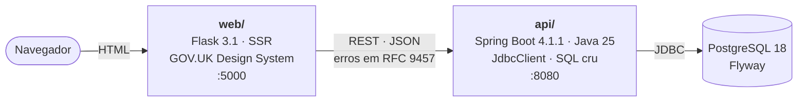

# Search the Land Register — projeto de estudo

Réplica de um serviço público de consulta ao registro de imóveis, construída para
aprender o stack usado pelas equipes do HM Land Registry: **Java Spring Boot com
SQL cru** no backend e **Python Flask com o GOV.UK Design System** no front-end.

Os dados são fictícios. Nenhum imóvel, pessoa ou credor mostrado é real.

## Telas

| Início | Busca | Erro de validação |
|---|---|---|
|  |  |  |

| Detalhe do título | Nenhum resultado |
|---|---|
|  |  |

## Arquitetura



O Flask não tem driver de banco instalado, por decisão arquitetural — ver
[ADR 0003](docs/adr/0003-flask-sem-driver-de-banco.md).

## Como rodar

Requisitos: Docker, JDK 25, `uv`, Node (só para baixar os assets do GOV.UK).

```bash
make dev
```

Depois abra <http://localhost:5000>. Experimente o número de título `SGL123457`,
que tem dois proprietários e dois ônus.

Outros alvos: `make help`.

## Testes

```bash
make test
```

- **API** — 14 testes. JUnit Jupiter 6 com Testcontainers contra PostgreSQL 18 real
  ([ADR 0002](docs/adr/0002-testcontainers-em-vez-de-h2.md)). A suíte roda com o
  PostgreSQL do host desligado.
- **Front-end** — 26 testes. Pytest com a API mockada via `respx`, incluindo um
  teste que verifica que cada âncora do error summary aterrissa num campo que
  realmente existe na página.

## API

Documentada em OpenAPI, com o contrato versionado em
[`docs/openapi.json`](docs/openapi.json). Um teste falha se o código divergir do
snapshot — verificado quebrando o contrato de propósito.

Com a API rodando: <http://localhost:8080/swagger-ui/index.html>

```
GET /api/v1/titles/{titleNumber}
```

Erros seguem RFC 9457 (Problem Details):

```json
{
  "type": "https://land-registry.study/problems/title-not-found",
  "title": "Title not found",
  "status": 404,
  "detail": "No title exists with the number ZZ000000",
  "instance": "/api/v1/titles/ZZ000000",
  "titleNumber": "ZZ000000"
}
```

## Containers e CI

Cada serviço tem um `Dockerfile` multi-estágio pensado para o **OpenShift**, que
ignora o `USER` da imagem e injeta um UID arbitrário no grupo 0. As duas imagens
rodam sob UID arbitrário, sem root e sem porta privilegiada:

```bash
make images-run     # sobe os dois containers com --user 1000670000:0
make images-down
```

Duas armadilhas encontradas ao fazer isso funcionar:

| Sintoma | Causa | Correção |
|---|---|---|
| Imagem funciona no `docker run`, quebra no cluster | arquivos não pertencem ao grupo 0 | `chgrp -R 0 /app && chmod -R g=u /app` |
| `gunicorn`: `Control server error: Permission denied: '/.gunicorn'` | sob UID arbitrário o usuário não está em `/etc/passwd`, `$HOME` vira `/` | `--no-control-socket` |

O mesmo pipeline está escrito em três formatos, porque o ambiente-alvo usa GitLab
com Jenkins e o repositório vive no GitHub:

| Arquivo | Plataforma | Executa? |
|---|---|---|
| [`.github/workflows/ci.yml`](.github/workflows/ci.yml) | GitHub Actions | sim |
| [`.gitlab-ci.yml`](.gitlab-ci.yml) | GitLab CI self-hosted | não — documenta o alvo |
| [`Jenkinsfile`](Jenkinsfile) | Jenkins declarativo | não — documenta o alvo |

## Decisões

- [0001 — SQL cru em vez de JPA](docs/adr/0001-sql-cru-em-vez-de-jpa.md)
- [0002 — Testcontainers em vez de H2](docs/adr/0002-testcontainers-em-vez-de-h2.md)
- [0003 — Flask sem driver de banco](docs/adr/0003-flask-sem-driver-de-banco.md)
- [0004 — GOV.UK Frontend pinado em 6.3.0](docs/adr/0004-govuk-frontend-pinado-em-6-3-0.md)

O design completo está em
[`docs/superpowers/specs/`](docs/superpowers/specs/2026-09-09-hmlr-land-register-design.md)
e o plano de implementação em
[`docs/superpowers/plans/`](docs/superpowers/plans/2026-09-10-fase-0-1-fatia-vertical.md).

## Notas de migração para o Spring Boot 4

Sete armadilhas encontradas ao construir isto, várias delas silenciosas. Podem ser
úteis para quem estiver migrando do Boot 3:

| Item | No Boot 3 | No Boot 4.1.1 |
|---|---|---|
| Starter web | `spring-boot-starter-web` | deprecado; use `spring-boot-starter-webmvc` |
| Flyway | `flyway-core` basta | precisa de `spring-boot-starter-flyway`; só o core **não roda migração** |
| `@WebMvcTest` | `spring-boot-starter-test` | precisa de `spring-boot-starter-webmvc-test`, pacote `org.springframework.boot.webmvc.test.autoconfigure` |
| Mock de bean | `@MockBean` | `@MockitoBean` |
| JUnit | Jupiter 5 | Jupiter 6 |
| Testcontainers | `org.testcontainers:postgresql` | `org.testcontainers:testcontainers-postgresql` (2.x renomeou tudo) |
| Volume do Postgres | `/var/lib/postgresql/data` | `/var/lib/postgresql` (mudança da imagem do PG 18) |

## Estado

Fases 0 e 1 concluídas: busca por número de título ponta a ponta.
Próximas: busca por postcode com paginação por keyset, fluxo de pedido com
check-your-answers, pagamento simulado e PDF.
